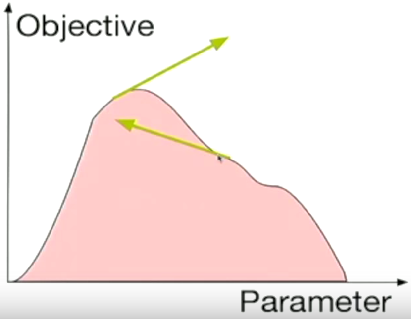

# Nicholas Clement
## 1. Learning Rate
Learning rate is vital to the efficiency and accuracy of our logistic regression. If too small a learning rate is chosen then code will take thousands of iterations to execute.

If our step size is too large we will end up oscillating and never finding a good solution.

To test step sizes I updated the unit tests to run with different step sizes and timed the execution.

## 2. Number of Iterations

It can be seen that it took 1061 iterations for us to reach a HA (Heldout accuracy) of about 95% and a TA (Train Accuracy) of about 97.5%.
